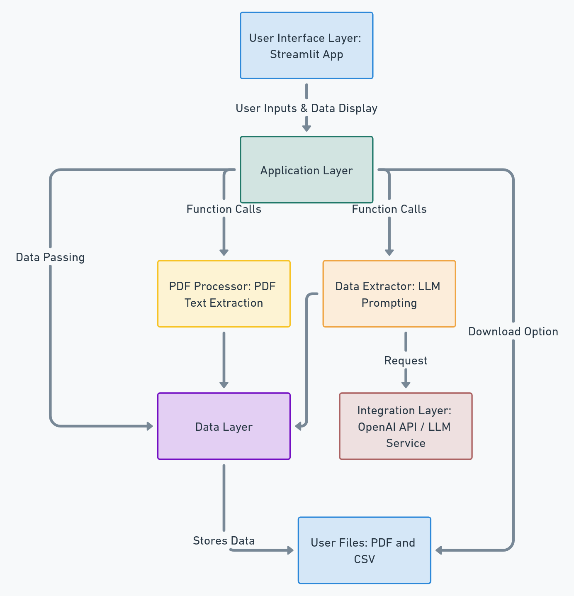

# Invoice Extraction Chatbot

## Overview
This project is an intelligent invoice extraction chatbot designed to automate the extraction of key information from PDF invoices. It leverages OCR (Optical Character Recognition) along with language models to retrieve structured data such as invoice numbers, dates, amounts, contact details, and item descriptions from uploaded PDF invoices. It outputs the extracted information in a structured format, such as a CSV file, streamlining data handling and reducing manual entry time.

## Architecture
The project is architected to modularize each responsibility effectively, utilizing distinct layers for user interaction, processing, data extraction, and external integration.



### Layered Components
1. **User Interface Layer**: A Streamlit app handles user inputs and displays the extracted data.
2. **Application Layer**: Contains core application logic for managing data extraction processes.
3. **PDF Processor**: Extracts raw text data from uploaded PDF files.
4. **Data Extractor**: Uses prompt-based interactions with large language models to structure and refine extracted data.
5. **Integration Layer**: Integrates with external LLMs, such as OpenAI, to process and interpret extracted data.
6. **Data Layer**: Manages temporary data handling, storage, and CSV file generation.

## Technologies Used
- **Streamlit**: For creating a user-friendly interface.
- **pypdf**: For PDF processing and text extraction.
- **OpenAI / LLM APIs**: For processing and interpreting extracted text into structured data.
- **Pandas**: For data manipulation and CSV generation.
- **dotenv**: For managing environment variables securely.

## Installation and Setup
To set up the project on your local environment:

```bash
# Clone the repository
git clone <repository-url>

# Navigate into the project directory
cd Invoice-Extraction-Chatbot

# Install dependencies
pip install -r requirements.txt

# Configure environment variables
cp .env.example .env
# Edit the .env file with your OpenAI API key and other required settings
```

## Usage
1. Start the Streamlit app:

    ```bash
    streamlit run app.py
    ```

2. Upload one or multiple PDF files through the Streamlit interface.
3. Click the **Extract Data** button to process and extract structured data.
4. Download the CSV file for the extracted data.

## Configuration Options
- **Environment Variables**:
    - `OPENAI_API_KEY`: API key for OpenAI integration.
    - Other environment variables can be set in `.env` file.

## Testing
- Testing guidelines can be added here to ensure data extraction accuracy and system robustness.

---


